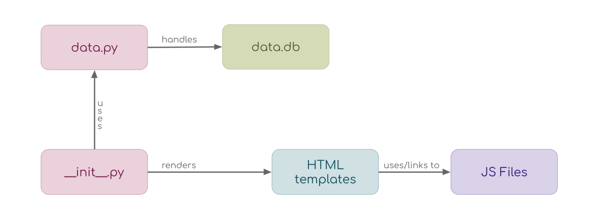
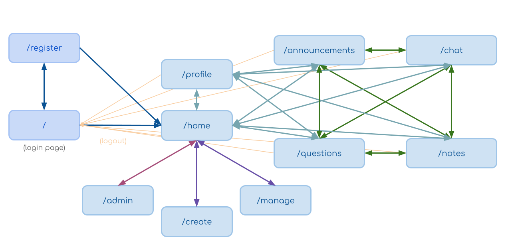

# System Blueprint
## TNPG: brune
## Project: Stuy Overflow

---

## Roster

| Name           | Email                         | Primary Role                | Secondary Role  |
|----------------|-------------------------------|-----------------------------|-----------------|
| Maya Berchin   | mayab97@nycstudents.net       | Developer, DB focus         | Project Manager |
| Megan Kwok     | megank21@nycstudents.net      | Developer, main UI focus    | Devlog Checker  |
| Christine Chen | christinec109@nycstudents.net | Developer, textbox focus    | Style Warden    |

---

## Summary
Stuy Overflow is a StuyCS tailored discussion platform inspired by Piazza (and Stack Overflow).
It provides a centralized space for communication, academic support, and easier access to resources within the StuyCS community.
Users will be able to create and repond to questions and share resources; teachers will be able to create assignments and announcements as well as respond to student questions.

### Problem Being Solved
StuyCS students aren't using Piazza as much as they could be.
Because of this, questions can go unanswered and teacher announcements missed.
Students might not know where to turn if they have an issue, or they might not know how to communicate the issue with enough context for it to be resolved.
With this product, we aim to make a Piazza that is easier and more convenient to use, acting as a central hub for resources and including structure specific to our students' needs.

### Target Users
- StuyCS students
- StuyCS teachers
- CS Dojo Staff

### Why This Project Matters
This project matters because students are more likely to ask for help and stay updated when class information is easy to access.
A centralized discussion platform can reduce repeated questions, ensure that important teacher posts are seen, and make it easier for students to find support from classmates,
teachers, or Dojo staff. This site will be more tailored for StuyCS than Piazza in the hopes that this will encourage more community engagement.

---

 

## Minimum Viable Product (MVP) Scope

### Core Features (Required for Final Submission)
Features that **must** be completed:  

1. Ability to post, edit, and respond to questions and notes. Should support formatting (as code, for example)
2. Ability to create, join, and switch between classes
3. Ability to give certain accounts a teacher role for a class, and permissions for teacher accounts that students don't have (such as posting assignments or removing posts)
4. Ability for a student or dojo member to post as anonymous
5. "Dojo" role, and the ability to make a question public to dojo members in addition to classmates

### Stretch Features (Only if MVP is Complete)

1. Supporting the ability to upload images from your filesystem or from the web in posts
2. Separate tabs for different types of posts: for example, one for announcements from teachers and one for quick questions
3. Providing templates to guide students in providing good context for their posts
4. Upvoting for questions and follow-ups
5. Ability to mark a follow-up as containing an answer/resolution to the original post, as opposed to follow-up questions or unsuccessful suggestions
6. Tagging system for post content similar to social media sites (tags are optional and can be anything, and once students start typing they'll see suggestions for similar, previously used tags)
7. Ability to tag other students and related posts
8. Better integration with other teacher resources: rendering teacher websites from a tab in our app, for example

### Explicit Non-Goals
Features intentionally **excluded**:  

1. Built-in/automated moderation or filtering. People on Piazza seem to behave well enough knowing the teachers can see their posts
2. Student ability to delete posts (Piazza excludes this too). We don't want people to delete questions when they get the answer
3. Any sort of grading/participation evaluation system to artificially encourage people to post

---

 

## Technology Stack

| Layer              | Selected Tool  |
|--------------------|----------------|
| Backend Framework  | Flask          |
| Frontend Framework | Bootstrap      |
| Database           | SQLite         |
| Authentication     | Flask Sessions |
| ORM / DB Library   | None           |

### Why This Stack Was Chosen
> Everyone on our team has been using Flask for all SoftDev projects up until now, so it was a natural decision to make that a part of our tech stack. Additionally, out of the databases and front-end frameworks we've used, we're most familiar with SQLite and Bootstrap respectively. We chose not to use a DB Library because we're used to using SQL without one.

---

 

## Team Ownership Plan

Each member's meaningful deliverables  

| Team Member    | Primary Ownership              | Secondary Ownership                   | Specific Deliverables                                                                                       |
|----------------|--------------------------------|---------------------------------------|-------------------------------------------------------------------------------------------------------------|
| Maya Berchin   | Database interactions          | Main view/list of posts in each tab   | File handling middleware, functional UI for each tab when viewing a list of posts                           |
| Megan Kwok     | UI for interacting with a post | Login/Register                        | Ways to create a post or follow-up, delete, upvote; login and register page                                 |
| Christine Chen | Textbox/inputs for posts       | Switching tabs/classes/posts          | Functional textbox with formatting options and templates for users, UI to switch between tabs/classes/posts |

---

 

## Component Map

 

## Site Map

---

 

## Key User Stories

### StuyCS Student
As a StuyCS student, I want to be able to post well-structured questions and notes on this site so that my classmates can understand what I'm getting at and help me out.
I want to find announcements my teacher made easily and be able to understand the context behind my classmates' questions.

### StuyCS Teacher
As a StuyCS teacher, I want to be able to see and respond to student posts, as well as make my own posts, so that I can communicate deadlines with students and see which topics they're confused about.  
I want to give students a place to ask each other questions to help build a community and reduce the time I spend on answering repeated questions.

### CS Dojo Staff
As a CS Dojo staff member, I want to use this platform to communicate with StuyCS so that we have a centralized place to gather information, help confused students, and convene with the whole StuyCS community.

---

 

## Database Design

### Database Type
**Relational**  

> Our team is the most experienced with using SQL databases, which are relational.

### Tables

_users_  

| Variable Type | Variable Name | Variable Attribute(s)                                     |
|---------------|---------------|-----------------------------------------------------------|
| TEXT          | user_id	      | PRIMARY KEY NOT NULL                                      |
| TEXT          | email         | UNIQUE NOT NULL                                           |
| TEXT          | github        |                                                           |
| TEXT          | name          | NOT NULL                                                  |
| TEXT          | password_hash | NOT NULL                                                  |
| TEXT          | is_dojo       | NOT NULL                                                  |
| TEXT          | is_sensei     | NOT NULL                                                  |
| TEXT          | is_teacher    | NOT NULL                                                  |
| TEXT          | classes       | (can have multiple, comma-separated)                      |
| TEXT          | unread_posts  | (can have multiple, comma-separated) (references post_id) |
| TEXT          | pinged_posts  | (can have multiple, comma-separated) (references post_id) |

 

_classes_  

| Variable Type | Variable Name | Variable Attribute(s)                                                           |
|---------------|---------------|---------------------------------------------------------------------------------|
| TEXT          | class_id      | PRIMARY KEY                                                                     |
| TEXT          | name          | NOT NULL                                                                        |
| TEXT          | owner_email   | NOT NULL FOREIGN KEY references user_id (can have multiple, comma-separated)    |
| TEXT          | teacher_email | NOT NULL FOREIGN KEY references user_id (can have multiple, comma-separated)    |
| TEXT          | member_email  | NOT NULL FOREIGN KEY references user_id (can have multiple, comma-separated)    |
| TEXT          | banned_email  | FOREIGN KEY references user_id (can have multiple, comma-separated)             |
| TEXT          | is_archived   | NOT NULL                                                                        |

 

_announcements_  

| Variable Type | Variable Name | Variable Attribute(s)                                                  |
|---------------|---------------|------------------------------------------------------------------------|
| TEXT          | post_id       | PRIMARY KEY                                                            |
| TEXT          | author_id     | NOT NULL FOREIGN KEY references user_id                                |
| TEXT          | class_id      | NOT NULL FOREIGN KEY references class_id                               |
| TEXT          | title         |                                                                        |
| TEXT          | body          | NOT NULL                                                               |
| TEXT          | created_at    | NOT NULL CURRENT_TIMESTAMP                                             |
| TEXT          | updated_at    | NOT NULL CURRENT_TIMESTAMP                                             |
| INTEGER       | upvotes       | NOT NULL                                                               |
| TEXT          | upvoted_by    | FOREIGN KEY references user_id (can have multiple, comma-separated)    |

 

_questions_  

| Variable Type | Variable Name | Variable Attribute(s)                                                  |
|---------------|---------------|------------------------------------------------------------------------|
| TEXT          | post_id       | PRIMARY KEY                                                            |
| TEXT          | author_id     | NOT NULL FOREIGN KEY references user_id                                |
| TEXT          | class_id      | NOT NULL FOREIGN KEY references class_id                               |
| TEXT          | title         |                                                                        |
| TEXT          | body          | NOT NULL                                                               |
| TEXT          | is_resolved   |                                                                        |
| TEXT          | created_at    | NOT NULL CURRENT_TIMESTAMP                                             |
| TEXT          | updated_at    | NOT NULL CURRENT_TIMESTAMP                                             |
| INTEGER       | upvotes       | NOT NULL                                                               |
| TEXT          | upvoted_by    | FOREIGN KEY references user_id (can have multiple, comma-separated)    |
| TEXT          | ping          | FOREIGN KEY references user_id (can have multiple, comma-separated)    |
| TEXT          | show_dojo     | NOT NULL                                                               |
| TEXT          | is_anonymous  | NOT NULL                                                               |

 

_notes_  

| Variable Type | Variable Name | Variable Attribute(s)                                                  |
|---------------|---------------|------------------------------------------------------------------------|
| TEXT          | post_id       | PRIMARY KEY                                                            |
| TEXT          | author_id     | NOT NULL FOREIGN KEY references user_id                                |
| TEXT          | class_id      | NOT NULL FOREIGN KEY references class_id                               |
| TEXT          | title         |                                                                        |
| TEXT          | body          | NOT NULL                                                               |
| TEXT          | created_at    | NOT NULL CURRENT_TIMESTAMP                                             |
| TEXT          | updated_at    | NOT NULL CURRENT_TIMESTAMP                                             |
| INTEGER       | upvotes       | NOT NULL                                                               |
| TEXT          | upvoted_by    | FOREIGN KEY references user_id (can have multiple, comma-separated)    |
| TEXT          | ping          | FOREIGN KEY references user_id (can have multiple, comma-separated)    |
| TEXT          | show_dojo     | NOT NULL                                                               |
| TEXT          | is_anonymous  | NOT NULL                                                               |

 

_chat_  

| Variable Type | Variable Name | Variable Attribute(s)                                                  |
|---------------|---------------|------------------------------------------------------------------------|
| TEXT          | post_id       | PRIMARY KEY                                                            |
| TEXT          | author_id     | NOT NULL FOREIGN KEY references user_id                                |
| TEXT          | class_id      | NOT NULL FOREIGN KEY references class_id                               |
| TEXT          | body          | NOT NULL                                                               |
| TEXT          | created_at    | NOT NULL CURRENT_TIMESTAMP                                             |

 

_followups_  

| Variable Type | Variable Name | Variable Attribute(s)                                                  |
|---------------|---------------|------------------------------------------------------------------------|
| TEXT          | post_id       | PRIMARY KEY                                                            |
| TEXT          | author_id     | NOT NULL FOREIGN KEY references user_id                                |
| TEXT          | class_id      | NOT NULL FOREIGN KEY references class_id                               |
| TEXT          | parent_id     | references previous post                                               |
| INTEGER       | depth         | NOT NULL                                                               |
| TEXT          | body          | NOT NULL                                                               |
| TEXT          | is_resolved   |                                                                        |
| TEXT          | is_answer     |                                                                        |
| TEXT          | created_at    | NOT NULL CURRENT_TIMESTAMP                                             |
| TEXT          | updated_at    | NOT NULL CURRENT_TIMESTAMP                                             |
| INTEGER       | upvotes       | NOT NULL                                                               |
| TEXT          | upvoted_by    | FOREIGN KEY references user_id (can have multiple, comma-separated)    |
| TEXT          | ping          | FOREIGN KEY references user_id (can have multiple, comma-separated)    |
| TEXT          | is_anonymous  | NOT NULL                                                               |

 

---

 

## Testing Plan

- Test database and middleware first: test each function and helper-function separately from the main program
- Test account creation (student/teacher/dojo) and class creation
- Test switching tabs (before posts are made)
- Test post creation and editing
- Ensure switching tabs and classes works properly now that posts have been made
- Test post moderation from a teacher account
- Test dojo access to questions
- Test tagging system (post content, other users/posts)
- Test posting as anonymous
- Test that posts/classes can only be viewed by whoever is supposed to have access to them
- For any stretch-goal feature we implement, test one by one (stretch goal features enumerated above)

---

 

## Timeline

### Week 1 Goals:
- Get most database functions working and tested; those to do with stretch features can wait
- Get account creation, authentication, and class creation working
- Get basic post creation working (no edits, no formatting)
- Get posting as anonymous working

### Week 2 Goals:
- Get post deletion from teacher account working
- Get basic followups working (no edits, no formatting, but do include status resolution)
- Get formatted posts working
- Get images in posts working
- Get post editing working
- Get tagging system working

### Week 3 Goals:
- Get different tabs for different post types working
- Get dojo role working as intended: allow dojo staff to see and respond to posts from confused students
- Get marking followups as containing answers working
- Get upvoting working
- Work to integrate with teacher websites and GitHub as much as possible
- Make the website theming more consistent and less ugly
- Implement as many stretch goals as possible!

### Internal Deadlines:

| Task                                                      | Deadline          |
|-----------------------------------------------------------|-------------------|
| Account creation, authentication                          | 05-14-26r         |
| Class creation                                            | 05-15-26f         |
| Basic posts                                               | 05-18-26m         |
| Post deletion                                             | 05-18-26m         |
| Followups                                                 | 05-18-26m         |
| Changing the status of a post or follow-up                | 05-18-26m         |
| Editing posts and followups                               | 05-19-26t         |
| Formatted posts                                           | 05-20-26w         |
| Tagging system                                            | 05-20-26w         |
| Images in posts                                           | 05-21-26r         |
| Dojo role seeing questions                                | 05-21-26r         |
| Tabs for different types of posts                         | 05-22-26f         |
| Upvotes                                                   | 05-22-26f         |
| Mark follow-ups as containing answers                     | 05-22-26f         |
| Consistent theming                                        | 05-25-26m         |
| Integration with teacher websites                         | 05-25-26m         |
| Complete whatever was missed above, same relative order   | 06-15-26m         |

---

 

## Completion Criteria (Definition of Done)
Project is considered **complete** when all of the following are true:  

1. We have a functional MV-plus-some-stretch-goals-P that also isn't ugly
2. Our site has some value to StuyCS because it's functional and tailored: that is, we added some features useful to StuyCS that Piazza doesn't have AND our app doesn't break
3. We are forcibly removed from the repo when the deadline comes/unable to update it (it can always be better) OR we give up and decide it's good enough

---

 

## Open Questions
- Will we be using React? If so, where? -- DECIDED: yes, for post creation!
- Should teachers be able to decide whether students can open their questions to Dojo staff?
- Should there be a delay before students get to open their questions to Dojo staff?
- Should there be any kind of reward/point system for being online or reading posts?
- Are we going to implement "related posts"?

## Appendix
- We're not sure to what extent we'll be able to integrate with GitHub and teacher websites, so we'll just do that as much as we're able
- We want to make our site a convenient central hub for StuyCS students, as we've heard from a lot that they have too many places to check for work and might ignore Piazza as a result
- We don't want to force students to post: according to a teacher, making posting on Piazza a requirement one year just led to performative-sounding posts and didn't actually help at all

## Other
- N/A

---
